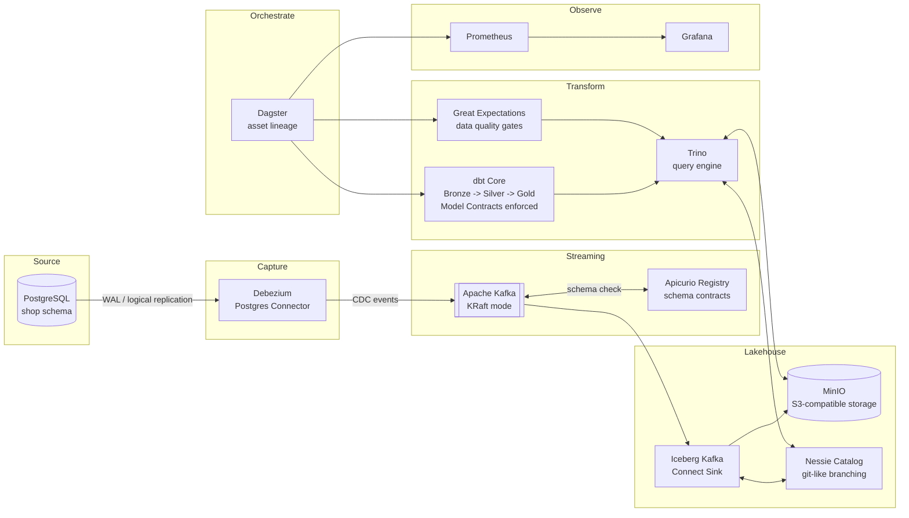

# Architecture

## Data flow

## The three contract enforcement layers

| # | Layer | Where | Failure mode |
|---|---|---|---|
| 1 | Ingestion | Apicurio Registry checks Avro schema compatibility before a Debezium event is accepted into Kafka | Incompatible schema change never reaches the lakehouse |
| 2 | Transformation | dbt `contract: {enforced: true}` on Silver/Gold models | `dbt run` fails the build if declared columns/types are violated |
| 3 | Quality | Great Expectations checkpoints against Trino | Dagster run fails if data violates row-level business rules |

## Current status

Tier 0: Postgres -> Debezium -> Kafka -> Iceberg (Bronze) -> Trino, queryable. Done, verified.

Tier 1: Apicurio contracts, dbt Silver/Gold with Model Contracts, Great
Expectations, and Dagster orchestration are all built and verified end to
end with real data, including two genuine (not staged) failures — see
`PORTFOLIO_ASSETS.md`. Prometheus + Grafana and the GitHub Actions
breaking-change CI workflow are code-complete (ADR 0023, ADR 0024) but
haven't had a first real run yet — no GitHub remote is configured for CI
to trigger against, and the observability stack hasn't been brought up on
a live run. That's the one thing left open in this tier.

Tier 2 (stretch, not started): OpenLineage/Marquez, Terraform IaC, chaos testing.

See [`docs/adr/`](./adr) for the reasoning behind each major decision (why Nessie over Polaris, why Dagster over Airflow, etc.) and [`PORTFOLIO_ASSETS.md`](../PORTFOLIO_ASSETS.md) for what gets captured at each milestone.
