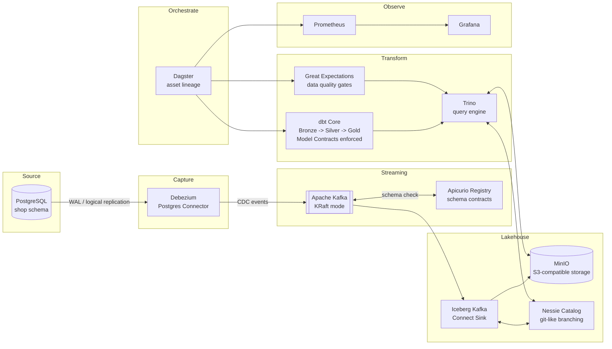

# Architecture

## Data flow

## The three contract enforcement layers

| # | Layer | Where | Failure mode |
|---|---|---|---|
| 1 | Ingestion | Apicurio Registry checks Avro schema compatibility before a Debezium event is accepted into Kafka | Incompatible schema change never reaches the lakehouse |
| 2 | Transformation | dbt `contract: {enforced: true}` on Silver/Gold models | `dbt run` fails the build if declared columns/types are violated |
| 3 | Quality | Great Expectations checkpoints against Trino | Dagster run fails if data violates row-level business rules |

## Current status

Tier 0: Postgres -> Debezium -> Kafka -> Iceberg (Bronze) -> Trino, queryable. Done, verified.

Tier 1: Apicurio contracts, dbt Silver/Gold with Model Contracts, Great
Expectations, Dagster orchestration, and GitHub Actions CI are all built
and verified end to end with real data, including three genuine (not
staged) failures — see `PORTFOLIO_ASSETS.md`. CI's breaking-change test
has a real, successful run on GitHub Actions (ADR 0023's Verified
section). Prometheus + Grafana are code-complete (ADR 0024) but haven't
had a first real run yet — the one thing left open in this tier.

Tier 2 (code-complete, first live runs pending): OpenLineage/Marquez
column-level lineage (ADR 0025), Terraform IaC for the local stack
(ADR 0026), and a Kafka broker chaos test with measured recovery
(ADR 0027) are all built and documented against real, confirmed sources —
this project's tooling had no Docker access during the session that wrote
them, so none have run against a live stack yet. Same status as the Tier
1 observability gap above: designed and documented carefully, not yet
observed working.

See [`docs/adr/`](./adr) for the reasoning behind each major decision (why Nessie over Polaris, why Dagster over Airflow, etc.) and [`PORTFOLIO_ASSETS.md`](../PORTFOLIO_ASSETS.md) for what gets captured at each milestone.
